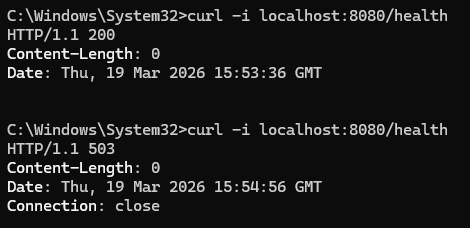
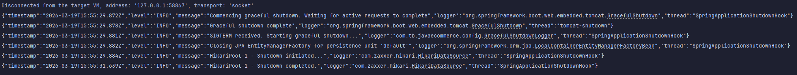

# JavaWeb-E-Commerce

## Environment variables

The application reads database configuration from a local `.env` file or from process environment variables.

Required variables:

- `DB_HOST`
- `DB_PORT`
- `DB_NAME`
- `DB_USER`
- `DB_PASSWORD`
- `HEALTH_DB_TIMEOUT_SECONDS` (optional, default: `2`)

1. Create a local `.env` file from `.env.example`.
2. Fill in the database settings.
3. Start the application.

## Health Check


## Logs Example
```
{"timestamp":"2026-03-19T16:02:46.523Z","level":"WARN","message":"Exception encountered during context initialization - cancelling refresh attempt: org.springframework.beans.factory.BeanCreationException: Error creating bean with name 'entityManagerFactory' defined in class path resource [org/springframework/boot/autoconfigure/orm/jpa/HibernateJpaConfiguration.class]: Failed to initialize dependency 'liquibase' of LoadTimeWeaverAware bean 'entityManagerFactory': Error creating bean with name 'liquibase' defined in class path resource [org/springframework/boot/autoconfigure/liquibase/LiquibaseAutoConfiguration$LiquibaseConfiguration.class]: liquibase.exception.DatabaseException: org.postgresql.util.PSQLException: Connection to localhost:5432 refused. Check that the hostname and port are correct and that the postmaster is accepting TCP/IP connections.","logger":"org.springframework.boot.web.servlet.context.AnnotationConfigServletWebServerApplicationContext","thread":"restartedMain"}
{"timestamp":"2026-03-19T16:02:46.527Z","level":"INFO","message":"Stopping service [Tomcat]","logger":"org.apache.catalina.core.StandardService","thread":"restartedMain"}
{"timestamp":"2026-03-19T16:02:46.536Z","level":"INFO","message":"\r\n\r\nError starting ApplicationContext. To display the condition evaluation report re-run your application with 'debug' enabled.","logger":"org.springframework.boot.autoconfigure.logging.ConditionEvaluationReportLogger","thread":"restartedMain"}
{"timestamp":"2026-03-19T16:02:46.550Z","level":"ERROR","message":"Application run failed","logger":"org.springframework.boot.SpringApplication","thread":"restartedMain","stacktrace":"org.springframework.beans.factory.BeanCreationException: Error creating bean with name 'entityManagerFactory' defined in class path resource [org/springframework/boot/autoconfigure/orm/jpa/HibernateJpaConfiguration.class]: Failed to initialize dependency 'liquibase' of LoadTimeWeaverAware bean 'entityManagerFactory': Error creating bean with name 'liquibase' defined in class path resource [org/springframework/boot/autoconfigure/liquibase/LiquibaseAutoConfiguration$LiquibaseConfiguration.class]: liquibase.exception.DatabaseException: org.postgresql.util.PSQLException: Connection to localhost:5432 refused. Check that the hostname and port are correct and that the postmaster is accepting TCP/IP connections.\r\n\tat org.springframework.beans.factory.support.AbstractBeanFactory.doGetBean(AbstractBeanFactory.java:326)\r\n\tat org.springframework.beans.factory.support.AbstractBeanFactory.getBean(AbstractBeanFactory.java:205)\r\n\tat org.springframework.context.support.AbstractApplicationContext.finishBeanFactoryInitialization(AbstractApplicationContext.java:954)\r\n\tat org.springframework.context.support.AbstractApplicationContext.refresh(AbstractApplicationContext.java:625)\r\n\tat org.springframework.boot.web.servlet.context.ServletWebServerApplicationContext.refresh(ServletWebServerApplicationContext.java:146)\r\n\tat org.springframework.boot.SpringApplication.refresh(SpringApplication.java:754)\r\n\tat org.springframework.boot.SpringApplication.refreshContext(SpringApplication.java:456)\r\n\tat org.springframework.boot.SpringApplication.run(SpringApplication.java:335)\r\n\tat org.springframework.boot.SpringApplication.run(SpringApplication.java:1363)\r\n\tat org.springframework.boot.SpringApplication.run(SpringApplication.java:1352)\r\n\tat com.tb.javaecommerce.JavaECommerceApplication.main(JavaECommerceApplication.java:13)\r\n\tat java.base/jdk.internal.reflect.DirectMethodHandleAccessor.invoke(DirectMethodHandleAccessor.java:103)\r\n\tat java.base/java.lang.reflect.Method.invoke(Method.java:580)\r\n\tat org.springframework.boot.devtools.restart.RestartLauncher.run(RestartLauncher.java:50)\r\nCaused by: org.springframework.beans.factory.BeanCreationException: Error creating bean with name 'liquibase' defined in class path resource [org/springframework/boot/autoconfigure/liquibase/LiquibaseAutoConfiguration$LiquibaseConfiguration.class]: liquibase.exception.DatabaseException: org.postgresql.util.PSQLException: Connection to localhost:5432 refused. Check that the hostname and port are correct and that the postmaster is accepting TCP/IP connections.\r\n\tat org.springframework.beans.factory.support.AbstractAutowireCapableBeanFactory.initializeBean(AbstractAutowireCapableBeanFactory.java:1806)\r\n\tat org.springframework.beans.factory.support.AbstractAutowireCapableBeanFactory.doCreateBean(AbstractAutowireCapableBeanFactory.java:600)\r\n\tat org.springframework.beans.factory.support.AbstractAutowireCapableBeanFactory.createBean(AbstractAutowireCapableBeanFactory.java:522)\r\n\tat org.springframework.beans.factory.support.AbstractBeanFactory.lambda$doGetBean$0(AbstractBeanFactory.java:337)\r\n\tat org.springframework.beans.factory.support.DefaultSingletonBeanRegistry.getSingleton(DefaultSingletonBeanRegistry.java:234)\r\n\tat org.springframework.beans.factory.support.AbstractBeanFactory.doGetBean(AbstractBeanFactory.java:335)\r\n\tat org.springframework.beans.factory.support.AbstractBeanFactory.getBean(AbstractBeanFactory.java:200)\r\n\tat org.springframework.beans.factory.support.AbstractBeanFactory.doGetBean(AbstractBeanFactory.java:313)\r\n\t... 13 common frames omitted\r\nCaused by: liquibase.exception.LiquibaseException: liquibase.exception.DatabaseException: org.postgresql.util.PSQLException: Connection to localhost:5432 refused. Check that the hostname and port are correct and that the postmaster is accepting TCP/IP connections.\r\n\tat liquibase.integration.spring.SpringLiquibase.afterPropertiesSet(SpringLiquibase.java:272)\r\n\tat org.springframework.beans.factory.support.AbstractAutowireCapableBeanFactory.invokeInitMethods(AbstractAutowireCapableBeanFactory.java:1853)\r\n\tat org.springframework.beans.factory.support.AbstractAutowireCapableBeanFactory.initializeBean(AbstractAutowireCapableBeanFactory.java:1802)\r\n\t... 20 common frames omitted\r\nCaused by: liquibase.exception.DatabaseException: org.postgresql.util.PSQLException: Connection to localhost:5432 refused. Check that the hostname and port are correct and that the postmaster is accepting TCP/IP connections.\r\n\tat liquibase.integration.spring.SpringLiquibase.lambda$afterPropertiesSet$0(SpringLiquibase.java:264)\r\n\tat liquibase.Scope.lambda$child$0(Scope.java:194)\r\n\tat liquibase.Scope.child(Scope.java:203)\r\n\tat liquibase.Scope.child(Scope.java:193)\r\n\tat liquibase.Scope.child(Scope.java:172)\r\n\tat liquibase.integration.spring.SpringLiquibase.afterPropertiesSet(SpringLiquibase.java:255)\r\n\t... 22 common frames omitted\r\nCaused by: org.postgresql.util.PSQLException: Connection to localhost:5432 refused. Check that the hostname and port are correct and that the postmaster is accepting TCP/IP connections.\r\n\tat org.postgresql.core.v3.ConnectionFactoryImpl.openConnectionImpl(ConnectionFactoryImpl.java:352)\r\n\tat org.postgresql.core.ConnectionFactory.openConnection(ConnectionFactory.java:54)\r\n\tat org.postgresql.jdbc.PgConnection.<init>(PgConnection.java:273)\r\n\tat org.postgresql.Driver.makeConnection(Driver.java:446)\r\n\tat org.postgresql.Driver.connect(Driver.java:298)\r\n\tat com.zaxxer.hikari.util.DriverDataSource.getConnection(DriverDataSource.java:137)\r\n\tat com.zaxxer.hikari.pool.PoolBase.newConnection(PoolBase.java:360)\r\n\tat com.zaxxer.hikari.pool.PoolBase.newPoolEntry(PoolBase.java:202)\r\n\tat com.zaxxer.hikari.pool.HikariPool.createPoolEntry(HikariPool.java:461)\r\n\tat com.zaxxer.hikari.pool.HikariPool.checkFailFast(HikariPool.java:550)\r\n\tat com.zaxxer.hikari.pool.HikariPool.<init>(HikariPool.java:98)\r\n\tat com.zaxxer.hikari.HikariDataSource.getConnection(HikariDataSource.java:111)\r\n\tat liquibase.integration.spring.SpringLiquibase.lambda$afterPropertiesSet$0(SpringLiquibase.java:259)\r\n\t... 27 common frames omitted\r\nCaused by: java.net.ConnectException: Connection refused: getsockopt\r\n\tat java.base/sun.nio.ch.Net.pollConnect(Native Method)\r\n\tat java.base/sun.nio.ch.Net.pollConnectNow(Net.java:682)\r\n\tat java.base/sun.nio.ch.NioSocketImpl.timedFinishConnect(NioSocketImpl.java:542)\r\n\tat java.base/sun.nio.ch.NioSocketImpl.connect(NioSocketImpl.java:592)\r\n\tat java.base/java.net.SocksSocketImpl.connect(SocksSocketImpl.java:327)\r\n\tat java.base/java.net.Socket.connect(Socket.java:751)\r\n\tat org.postgresql.core.PGStream.createSocket(PGStream.java:260)\r\n\tat org.postgresql.core.PGStream.<init>(PGStream.java:121)\r\n\tat org.postgresql.core.v3.ConnectionFactoryImpl.tryConnect(ConnectionFactoryImpl.java:140)\r\n\tat org.postgresql.core.v3.ConnectionFactoryImpl.openConnectionImpl(ConnectionFactoryImpl.java:268)\r\n\t... 39 common frames omitted\r\n"}
```

## Graceful Shutdown
